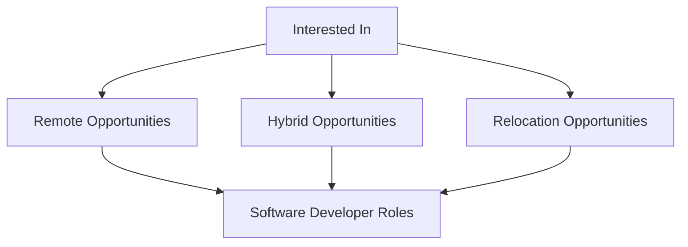

Hi My name is Daniel Ayeni
====================================================================================================================================

I'm a Software Developer
------------------

A resourceful full-stack developer & technical writer with a strong understanding of MERN stack and other latest technology trends to develop, test, debug, deploy and document web applications and the development processes. Experienced in handling complex technical challenges and using efficient coding techniques to meet projects and organizations’ needs geared towards growth.

* 🌍  I'm based in Nigeria
* 🖥️  See my portfolio at [Danthesage](http://danthesage.com)
* ✉️  You can contact me at [ayenibabajidedaniel@gmail.com](mailto:ayenibabajidedaniel@gmail.com)
* 🚀  I'm currently working on [Daily Shege](https://dailyshege.com)
* 🧠  I'm learning Docker and Software Design System
* 🤝  I'm open to collaborating on Open Source Projects
* ⚡  I'm a superstar... Yes! You can tell everyone

### I am eager to connect with you 😁!

### Skills

 

### Socials

    

### Badges

### Support Me

