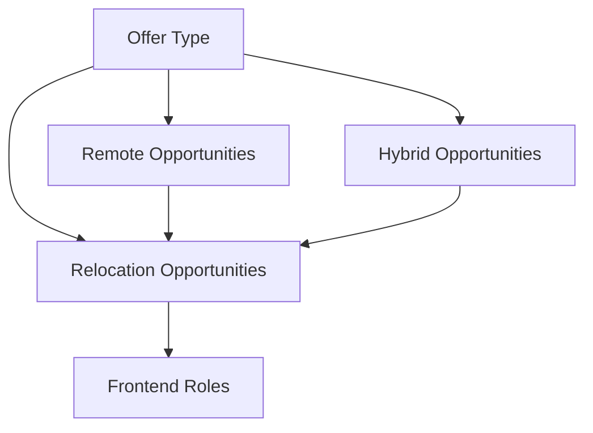

### Hi there, 👋

###😄 I am Daniel Ayeni, also popularly known as DanTheSage. I am a Frontend Developer.

###🔭 I develop pixel-perfect UIs, responsive websites & web applications.

###👌 You can visit my portfolio at https://danthesage.com.

###📫 You can also reach me @Danthesage on Twitter, Daniel Ayeni on LinkedIn & Daniel Ayeni on Upwork(https://www.upwork.com/freelancers/~0102eddb161a3f00c0). 

###🌱 I’m currently open to collaborating on new projects, contracts and jobs.

###👯 I’m looking forward to resources and tasks to enhance my software development skills and learning. 

###⌨️ Let's chat about anything around software development, football, writing and geography. 

### I am eager to meet you 😁!

